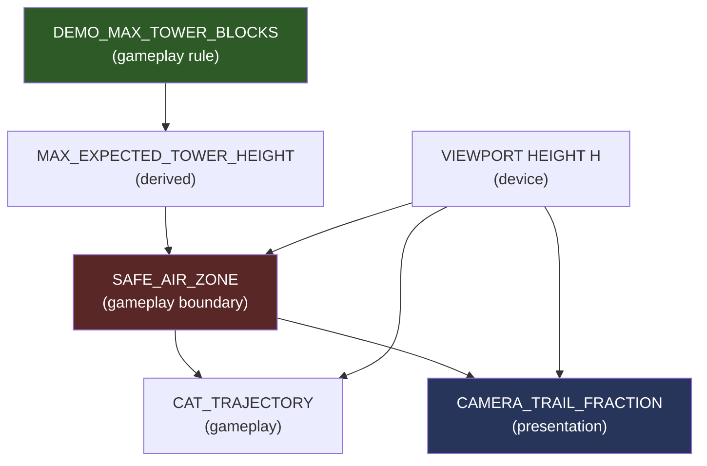

# Архитектурный Review: Механика Активного Кота — Воздушная Траектория + TAP

## Verdict: CONDITIONAL GO ✅ (с обязательными исправлениями)

Концепция правильная. Реализация Claude содержит **3 критических архитектурных ошибки** и **5 необходимых корректировок**. Ниже — полный анализ.

---

## 1. Проверка интерпретации CAMERA_TRAIL_FRACTION

> [!CAUTION]
> **Claude ошибается в математике камеры. Его число 254px неверно.**

### Как камера работает в реальном коде

Камера в проекте — **не viewport offset сверху**. Это world-space Y-offset.

```
// physics.js:244-248
function updateCameraTarget(topY) {
  if (topY - state.targetCameraY > state.H * CAMERA_TRAIL_FRACTION) {
    state.targetCameraY = topY - state.H * CAMERA_TRAIL_FRACTION;
  }
}
```

**Формула:** `targetCameraY = topY - H * 0.55`

Это значит: камера **начинает двигаться**, когда расстояние от `topY` (верхушка башни в world-space) до `cameraY` превышает `H * 0.55`.

### Как блоки отображаются на экране

```
// renderer.js:109
screenY = state.H - GROUND_MARGIN - (b.y - state.cameraY) - BLOCK_H
```

Для верхнего блока башни, когда камера только начала следить:
```
topY - cameraY = H * 0.55
screenY = H - 60 - H*0.55 - 46 = H - 60 - 0.55*H - 46
```

При H=800:
```
screenY = 800 - 60 - 440 - 46 = 254px от верхнего края экрана
```

> [!NOTE]
> **Число Claude (254px) случайно совпало**, но его интерпретация некорректна. Он описывает это как «башня окажется на 254px от верхнего края». Это верно **только в момент, когда камера ТОЛЬКО ЧТО начала движение**. 
> 
> На самом деле `CAMERA_TRAIL_FRACTION` — это **порог срабатывания**, а не фиксированная позиция. Камера использует lerp (`cameraLerpRate = 0.1`), поэтому между обновлениями камеры башня может быть **выше** этой позиции на экране, пока камера «догоняет».

### Реальная проблема

Камера — это **лениво следящая** система:
1. `updateCameraTarget` вызывается только при `handleDrop` (размещении нового блока)
2. Между дропами камера **не обновляет targetCameraY** — башня может вырасти
3. Lerp не мгновенный: `state.cameraY += (target - cameraY) * 0.1 * k`

**Вывод:** Позиция верхушки башни на экране **не детерминирована** одним `CAMERA_TRAIL_FRACTION`. Привязка к камере — ошибка.

---

## 2. ГЛАВНЫЙ АРХИТЕКТУРНЫЙ ВОПРОС: Направление зависимости

> [!IMPORTANT]
> **Ваша интуиция полностью верна. Архитектура Claude инвертирует зависимость.**

### Claude предлагает:
```
CAMERA (presentation) → MAX_TOWER_POSITION (derived) → SAFE_AIR_ZONE → CAT
```

### Правильная архитектура:
```
GAMEPLAY_RULE: MAX_TOWER_HEIGHT_FOR_DEMO
  → SAFE_AIR_ZONE (gameplay boundary)
    → CAT_TRAJECTORY (gameplay)
    → CAMERA (presentation, reads the same gameplay rule)
```

### Почему это критично

| Проблема | Claude | Правильно |
|---------|--------|-----------|
| Изменение `CAMERA_TRAIL_FRACTION` | Ломает safe zone кота | Не влияет на gameplay |
| Изменение camera lerp rate | Может привести к столкновению | Не влияет |
| Другой viewport | Другие gameplay bounds | Gameplay bounds стабильны |
| Добавление camera shake | Кот визуально в tower zone | Не влияет |

### Рекомендация

Создать **единый источник правды** для gameplay bounds:

```
// config.js или отдельный GameplayBounds.js
DEMO_MAX_TOWER_BLOCKS = 50          // максимум блоков в деморежиме
BLOCK_H = 46                        // высота блока
MAX_TOWER_HEIGHT = DEMO_MAX_TOWER_BLOCKS * BLOCK_H  // 2300px в world-space
```

Камера и траектория кота **читают** это значение, но **не определяют** его.

---

## 3. MAX_EXPECTED_TOWER_HEIGHT

### Реальные данные из кода

| Параметр | Значение | Источник |
|----------|----------|---------|
| `BLOCK_H` | 46px | [config.js:5](file:///c:/Projects/cat-tower/src/game/config.js#L5) |
| Максимальный уровень | Level 5 "Космос", startFloor=40 | [config.js:56](file:///c:/Projects/cat-tower/src/game/config.js#L56) |
| columnWidth (mobile) | 120-140px | [gameState.js:110](file:///c:/Projects/cat-tower/src/game/gameState.js#L110) |
| Минимальный блок | `0.26 * columnWidth ≈ 36px` wide | [gameState.js:308](file:///c:/Projects/cat-tower/src/game/gameState.js#L308) |

### Что учитывать для Design Maximum

1. **Стеклянный потолок башни** — Башня коллапсирует при `criticalTilt ≈ 0.40 рад` для коротких башен, но динамически уменьшается для высоких (см. [getCriticalTilt](file:///c:/Projects/cat-tower/src/game/gameState.js#L181-L201)). На мобильном: `maxAllowedSway = W * 0.30`. При `W=390px`, `maxSway ≈ 117px`. Башня коллапсирует когда `sin(angle) * towerHeight > 117px`, т.е. при высоте ~300px (≈7 блоков) criticalTilt начинает быстро уменьшаться.

2. **Практический максимум** — Реально строить башню выше 20-25 блоков крайне сложно. На high floors (30+) скорость и ветер делают это почти невозможным.

3. **Наклон как bounding box multiplier** — Башня при `towerAngle = 0.15 рад` поднимает визуальный top на `sin(0.15) * lastBlock_x_offset ≈ 0.15 * 70 ≈ 10px`. Незначительно.

### Рекомендация

```
// Gameplay Design Constant (config.js)
DEMO_MAX_TOWER_BLOCKS: 30           // Design max для trajectory safety
TOWER_HEIGHT_SAFETY_MARGIN: 1.2     // 20% запас на наклон + bounding
MAX_EXPECTED_TOWER_HEIGHT: 30 * 46 * 1.2 = 1656px  // в world-space
```

Но для **screen-space safe zone** нужна другая модель (см. пункт 7).

---

## 4. CAT BOUNDING BOX

> [!WARNING]
> Claude использует `mover.height || BLOCK_H`, но в коде **mover не имеет свойства height**.

### Реальный размер кота из кода

| Элемент | Размер | Источник |
|---------|--------|---------|
| Тело блока | `BLOCK_H = 46px` | [config.js:5](file:///c:/Projects/cat-tower/src/game/config.js#L5) |
| Уши (вверх) | `earH = min(14, BLOCK_H * 0.38) = 14px` | [drawCats.js:98](file:///c:/Projects/cat-tower/src/render/drawCats.js#L98) |
| Sticky капли (вниз) | `~5px` ниже тела | [drawCats.js:90](file:///c:/Projects/cat-tower/src/render/drawCats.js#L90) |
| Light bounce | `±2px` вертикально | [drawCats.js:33](file:///c:/Projects/cat-tower/src/render/drawCats.js#L33) |

### Полный visual height кота
```
VISUAL_CAT_HEIGHT = 14 (ears) + 46 (body) + 5 (sticky drips) = 65px максимум
```

### Рекомендация для clearance

```
CAT_VISUAL_HALF_HEIGHT = 33px        // половина от максимального visual height
CAT_CLEARANCE = BLOCK_H + 14         // = 60px (тело + уши, упрощённо)
```

Использовать **full height (body + ears)**, а не half height. Кот — не точка. Его **нижний** край (body bottom) не должен пересечь safe zone boundary.

### Ширина при входе/выходе

Да, нужно учитывать. Максимальный mover width = `columnWidth * 1.0 = 140px` (mobile). При вылете за экран текущий код проверяет `x <= limits.spawnLeft` и `x >= limits.spawnRight`, что уже учитывает позицию по X. Но для **новой дуговой траектории** кот должен быть **полностью за экраном** перед респауном, иначе будет видно «телепортацию». Нужно:

```
isFullyOffScreen = (mover.x + mover.width < -OFFSCREEN_MARGIN) || 
                   (mover.x > screenWidth + OFFSCREEN_MARGIN)
```

---

## 5. GUARANTEED_AIR_GAP = 20px

> [!WARNING]
> 20 абсолютных пикселей — **опасно мало** и **не масштабируется**.

### Проблема

| Устройство | Viewport H | 20px = | Восприятие |
|------------|-----------|--------|-----------|
| iPhone SE | 568px | 3.5% | Едва заметно |
| iPhone 14 | 844px | 2.4% | Незаметно |
| Galaxy Fold | 717px | 2.8% | Незаметно |

### Рекомендация: Трёхслойная модель

```
// 1. GAMEPLAY GAP — гарантирует что физика башни не пересечёт траекторию
GAMEPLAY_AIR_GAP = BLOCK_H * 1.5 = 69px
// Обоснование: максимальный наклон + один блок + запас

// 2. VISUAL_AIR_GAP — визуально читаемое расстояние
VISUAL_AIR_GAP = max(BLOCK_H, H * 0.06) 
// На H=800: max(46, 48) = 48px
// На H=568: max(46, 34) = 46px

// 3. TOTAL_CLEARANCE = GAMEPLAY_AIR_GAP + VISUAL_AIR_GAP
// На H=800: 69 + 48 = 117px ≈ 14.6% экрана
```

Это даёт **визуально очевидный** воздух между башней и котом на любом устройстве.

---

## 6. TRAJECTORY_TOP = H * 0.08

### Анализ

8% от верха — это:
| Устройство | H | 8% = | Safe area | Остаётся |
|------------|---|------|-----------|----------|
| iPhone SE | 568 | 45px | ~20px status bar | 25px |
| iPhone 14 Pro | 852 | 68px | ~59px (notch+status) | 9px ⚠️ |
| iPhone 14 | 844 | 68px | ~47px (Dynamic Island) | 21px |
| Android avg | 780 | 62px | ~24px status bar | 38px |

> [!WARNING]
> На iPhone с Dynamic Island 8% **недостаточно** — кот будет частично за системным UI.

### Рекомендация

```
TRAJECTORY_TOP_MARGIN = max(H * 0.10, 80)
// На H=568: max(57, 80) = 80px — безопасно
// На H=852: max(85, 80) = 85px — безопасно
```

Дополнительно: CSS `env(safe-area-inset-top)` можно прочитать и добавить к margin. Но для **canvas** игры проще использовать фиксированный `max(H*0.10, 80)`.

Также учесть, что **кот имеет уши 14px выше body**, поэтому реальный margin = `TRAJECTORY_TOP_MARGIN + 14 (ear height)`.

---

## 7. TRAJECTORY BOTTOM — Модель безопасной зоны

> [!IMPORTANT]
> Claude делает `trajectoryEntryY = trajectoryBottom` — кот входит на высоте нижней границы safe zone. Это **слишком близко** к башне.

### Правильная модель (screen-space, Y↓)

```
┌──────────────────────┐ y=0
│   SYSTEM UI / NOTCH  │
├──────────────────────┤ y = TRAJECTORY_TOP_MARGIN (10% или 80px)
│                      │
│   AIR ZONE (кот)     │ ← кот летает здесь
│   trajectory top     │
│   trajectory bottom  │
│                      │
├──────────────────────┤ y = TRAJECTORY_BOTTOM_LIMIT
│   VISUAL AIR GAP     │ ← визуально читаемый зазор
├──────────────────────┤ y = MAX_TOWER_TOP_SCREEN  
│                      │
│   TOWER ZONE         │ ← башня растёт снизу вверх
│                      │
├──────────────────────┤ y = H - GROUND_MARGIN (60px)
│   GROUND             │
└──────────────────────┘ y = H
```

### Расчёт для screen-space

```
MAX_TOWER_TOP_SCREEN = H * (1 - CAMERA_TRAIL_FRACTION) - GROUND_MARGIN
                     = H * 0.45 - 60
// При H=800: 300px от верха

TRAJECTORY_BOTTOM = MAX_TOWER_TOP_SCREEN - VISUAL_AIR_GAP - CAT_CLEARANCE
                  = 300 - 48 - 60 = 192px от верха

TRAJECTORY_TOP = TRAJECTORY_TOP_MARGIN + CAT_CLEARANCE
               = 80 + 60 = 140px от верха  

TRAJECTORY_BAND_HEIGHT = TRAJECTORY_BOTTOM - TRAJECTORY_TOP
                       = 192 - 140 = 52px
```

> [!CAUTION]
> **52px — это очень узкая полоса!** На H=800 это всего 6.5% экрана. Дуга должна быть **внутри** этой полосы, что сильно ограничивает visual drama.

### Решение: Пересмотреть пропорции

Для более широкой дуги нужно:
1. **Уменьшить MAX_TOWER_TOP_SCREEN** → ограничить когда камера начинает следить. Но это изменит камеру.
2. **Или** принять что на высоких башнях дуга будет уже, а на низких — шире. Это **natural difficulty scaling**.
3. **Или** связать AIR_GAP с реальной высотой башни, а не с worst case.

**Рекомендация:** Использовать **динамический** trajectory bottom:

```
// Реальная позиция верхушки башни на экране (точная)
actualTowerTopScreen = H - GROUND_MARGIN - (getTopFloorY() - state.cameraY) - BLOCK_H

// Динамический trajectory bottom с гарантированным зазором
trajectoryBottom = min(
  actualTowerTopScreen - GAMEPLAY_AIR_GAP - CAT_CLEARANCE,  // от реальной башни
  H * 0.35 - CAT_CLEARANCE                                  // абсолютный максимум (не ниже 35% экрана)
)
```

Это даёт **широкую дугу** на низких башнях и **сжатую, но безопасную** на высоких.

---

## 8. ТРАЕКТОРИЯ — Тип кривой

### Сравнение вариантов

| Тип | Плавность | Предсказуемость | Контроль | Живость | Сложность |
|-----|-----------|----------------|----------|---------|-----------|
| Линейный + синус Y | Низкая | Высокая | Средний | Низкая | Простая |
| Параболическая арка | Средняя | Высокая | Низкий | Средняя | Простая |
| Синусоидальная арка | Высокая | Высокая | Средний | Средняя | Простая |
| Cubic Bezier | Высокая | Средняя | Высокий | Высокая | Средняя |
| Piecewise Bezier | Очень высокая | Средняя | Очень высокий | Очень высокая | Сложная |
| Parametric (Claude) | Средняя | Высокая | Средний | Низкая | Средняя |

### Рекомендация: Синусоидальная арка с easing

```
// t: 0 → 1 (нормализованный прогресс по горизонтали)
// Горизонтальное движение: линейное с eased edges
x(t) = lerp(startX, endX, t)

// Вертикальное: синусоидальная арка
y(t) = trajectoryBottom - sin(t * PI) * (trajectoryBottom - trajectoryTop)
```

**Преимущества:**
- `sin(PI * t)` даёт **естественную арку** — ускорение вверх, замедление на пике, ускорение вниз
- Один параметр для контроля высоты
- Полностью предсказуемый timing
- Легко clampить в safe zone
- Выглядит как прыжок, не как Тетрис

**Easing на горизонтали** для живости:
```
// easedT замедляет движение на краях (разворот)
easedT = t < 0.5 
  ? 2 * t * t                           // ease-in
  : 1 - Math.pow(-2 * t + 2, 2) / 2     // ease-out
```

---

## 9. TURNING — Механика разворота

### Проблема с FLYING_IN → TURNING → FLYING_IN

Дискретные стейты создают **видимый seam** — момент, когда кот «решает» развернуться. Это выглядит механически.

### Рекомендация: Continuous Motion (без отдельного TURNING state)

Используйте **пинг-понг параметр t**:

```
// t: 0 → 1 → 0 → 1 → 0 ... (пинг-понг)
// direction: 1 или -1 (текущее направление горизонтального движения)

phase += speed * dt;
t = (sin(phase) + 1) / 2;  // 0..1 smooth oscillation

x = lerp(leftBound, rightBound, t);
y = trajectoryBottom - sin(t * PI) * arcHeight;
```

**Преимущества:**
- **Нет разворота как события** — движение плавно меняет направление
- Скорость естественно замедляется на краях (производная синуса = 0 на пиках)
- Один state: `FLYING`
- TURN_DURATION не нужен — это emergent behavior
- Выглядит как кот, который грациозно кружит в воздухе

**Для визуального flip кота (зеркалирование спрайта):**
```
catFacingRight = cos(phase) > 0;  // производная sin(phase)
```

---

## 10. TAP — Физика прыжка с траектории

### Анализ предложенных значений

```
RELEASE_HORIZONTAL_MOMENTUM = 0.4     // 40% текущей горизонтальной скорости
RELEASE_DOWNWARD_IMPULSE = 300        // px/frame? px/sec?
RELEASE_GRAVITY = 1200                // px/sec²?
```

> [!CAUTION]
> **Критическая проблема: единицы измерения.**

### Существующая физика проекта использует `k`-фактор

```javascript
// gameLoop.js:14
const k = (dt * 60) / 1000;   // нормализация к 60fps: при 60fps k=1, при 30fps k=2

// ActiveCatSystem.js:66-68 (текущая)
mover.screenVy += PARABOLA_GRAVITY * k;     // PARABOLA_GRAVITY = 0.25
mover.screenY += mover.screenVy * k;
mover.x += mover.vx * k;
```

Это **НЕ стандартная физика** с секундами. Это **frame-normalized** физика, где:
- Скорости в `px/frame` (при 60fps)
- Ускорения в `px/frame²`
- `k` = коэффициент компенсации фреймрейта

### Значения Claude в этих единицах

```
RELEASE_DOWNWARD_IMPULSE = 300    → При k=1 это 300 px/frame начальная скорость вниз
                                  → Экран пролетит за 2-3 кадра. ЭТО МГНОВЕННЫЙ TELEPORT.

RELEASE_GRAVITY = 1200            → 1200 px/frame² ускорение
                                  → Полностью бессмысленное значение в k-системе
```

> [!CAUTION]
> **Если Claude подразумевал px/sec и px/sec², то его система конфликтует с существующей k-based физикой.** Это именно та «вторая параллельная физика», которую вы хотите избежать.

### Рекомендация: Использовать k-систему

```
RELEASE_HORIZONTAL_RETAIN = 0.4        // сохранить 40% горизонтальной скорости (OK)

// Начальная скорость вниз после TAP (в k-единицах, как существующая SLOW_FALL_GRAVITY)
RELEASE_INITIAL_VY = -4.0              // вниз = отрицательный screenVy
// Для сравнения: jumpSpeedY ≈ sqrt(2 * 0.25 * H*0.25) ≈ 10-14 при H=800

// Гравитация при падении после TAP
RELEASE_GRAVITY = 0.35                 // чуть больше PARABOLA_GRAVITY (0.25)
// Дает ощущение "кот прыгнул вниз", а не "кот замер и медленно опустился"
```

### Переход к существующей физике

После TAP кот использует k-based физику для падения → при касании поверхности вызывается `handleDrop()` → существующая физика башни.

**Это уже работает** в текущем [ActiveCatSystem.updateFalling](file:///c:/Projects/cat-tower/src/game/physics/ActiveCatSystem.js#L89-L105), нужно только:
1. Не обнулять `vx` (текущий код делает `mover.vx = 0` на строке 92)
2. Вместо этого: `mover.vx *= RELEASE_HORIZONTAL_RETAIN`

---

## 11. GAMEPLAY: Timing → Position mapping

### Проверка: создаёт ли momentum + release честную зависимость от тайминга?

С синусоидальной траекторией:

```
t=0.0  (левый край):  x=leftBound,   vx=max_positive,  drop → далеко вправо от башни
t=0.25 (1/4 пути):    x=center-ish,  vx=positive,      drop → чуть правее центра  
t=0.5  (пик арки):    x=center,      vx=0,             drop → вертикально на центр ✓
t=0.75 (3/4 пути):    x=center+ish,  vx=negative,      drop → чуть левее центра
t=1.0  (правый край): x=rightBound,  vx=max_negative,  drop → далеко влево от башни
```

**Да, это создаёт правильную зависимость:**
- Early/late TAP = большой горизонтальный импульс, кот улетает мимо
- Mid TAP = малый импульс, точное попадание
- Optimal TAP = на пике арки (vx≈0, x≈center)

> [!TIP]
> **Бонус: «sweet spot» на пике арки** — это когда кот на максимальной высоте и минимальной горизонтальной скорости. Визуально интуитивно: "кот в высшей точке прыжка = нажми сейчас!"

### Рекомендация

Добавить **мягкий визуальный hint** на пике арки:
- Slight glow / scale pulse кота
- Не подсказка, а «ощущение» правильного момента

---

## 12. ПРОБЛЕМА ТЯЖЁЛОГО КОТА

### Анализ

Текущие массы:
| Тип | mass | width range | Ширина (px) |
|-----|------|-------------|-------------|
| normal | 1.0 | 0.26-1.0 | 36-140 |
| light | 0.5 | 0.26-0.65 | 36-91 |
| **heavy** | **2.2** | **0.65-1.0** | **91-140** |
| slippery | 1.1 | 0.26-0.45 | 36-63 |
| sticky | 1.0 | 0.45-0.85 | 63-119 |

Тяжёлый кот: масса 2.2x + широкий. При `RELEASE_HORIZONTAL_RETAIN = 0.4` его горизонтальный drift будет **таким же** как у лёгкого кота (40% скорости не зависит от массы).

### Потенциальная проблема

Тяжёлый кот падает **быстрее** (при SLOW_FALL_GRAVITY, не зависящей от массы, все коты падают одинаково). Но если добавить mass-based gravity:
```
vy -= gravity * mass * k   // НЕЛЬЗЯ — тяжёлый кот падает мгновенно
```

### Рекомендация

1. **Не масштабировать гравитацию по массе** — все коты падают с одинаковой скоростью (как в реальности, Галилей)
2. **Различие через ширину**: широкий кот имеет больше tolerance — попасть легче, но баланс хуже
3. **Mass effect проявляется ПОСЛЕ приземления** — через существующий `DROP_IMPULSE_FACTOR` и tower physics
4. Timing одинаково честный для всех типов котов ✓

---

## 13. PORTRAIT-FIRST Layout

### Расчёт для трёх экранов

| | iPhone SE (320×568) | iPhone 14 (390×844) | Galaxy S21 (360×800) |
|--|---------------------|---------------------|----------------------|
| `columnWidth` | 112px | 137px | 126px |
| TRAJECTORY_TOP | 80px | 84px | 80px |
| MAX_TOWER_TOP_SCREEN | 195px | 320px | 300px |
| TRAJECTORY_BOTTOM | ~120px | ~210px | ~190px |
| **Доступная высота дуги** | **40px** ⚠️ | **126px** ✓ | **110px** ✓ |
| Кот (макс width) | 112px | 137px | 126px |
| Кот / экран ширина | 35% ✓ | 35% ✓ | 35% ✓ |

> [!WARNING]
> **На iPhone SE (320×568) дуга сжимается до 40px** — кот будет двигаться почти горизонтально. Это **неприемлемо** визуально.

### Решение для маленьких экранов

```
MIN_ARC_HEIGHT = BLOCK_H * 1.5 = 69px   // минимальная высота арки
if (available_arc_height < MIN_ARC_HEIGHT) {
  // Уменьшить GAMEPLAY_AIR_GAP до минимума
  // Или сдвинуть tower top screen ниже (camera follows aggressive)
}
```

Альтернатива: на очень маленьких экранах сделать **динамическую дугу** — чем выше башня, тем уже дуга, но с абсолютным минимумом.

---

## 14. КАМЕРА — Детальный анализ

### Как работает камера (полный разбор)

1. **Инициализация** ([gameState.js:232](file:///c:/Projects/cat-tower/src/game/gameState.js#L232)):
```javascript
state.targetCameraY = Math.max(0, topY - state.H * CAMERA_TRAIL_FRACTION);
state.cameraY = state.targetCameraY;  // мгновенная установка
```

2. **Обновление цели** ([physics.js:244](file:///c:/Projects/cat-tower/src/game/physics.js#L244)):
```javascript
function updateCameraTarget(topY) {
  if (topY - state.targetCameraY > state.H * CAMERA_TRAIL_FRACTION) {
    state.targetCameraY = topY - state.H * CAMERA_TRAIL_FRACTION;
  }
}
```
Вызывается **только в handleDrop** — только при размещении блока.

3. **Interpolation** ([gameLoop.js:21](file:///c:/Projects/cat-tower/src/game/gameLoop.js#L21)):
```javascript
state.cameraY += (state.targetCameraY - state.cameraY) * 0.1 * k;
```

### Критические находки

| Вопрос | Ответ |
|--------|-------|
| Камера следит за башней? | Да, но **ленивый одностороний follow** — только вверх, с лерпом |
| Есть ли верхний предел? | **Нет!** Камера может подниматься бесконечно |
| Как определяется topY? | `getTopFloorY()` = максимальный `b.y + BLOCK_H` среди всех блоков |
| Может ли наклон поднять bounding box? | Нет — `b.y` это world-space Y, не зависит от towerAngle. Sway влияет только на X |
| Может ли камера вывести башню в trajectory zone? | **ДА** — если камера лагает (`lerp 0.1`), верхушка башни временно ближе к top экрана |

### Проблема camera lag

Между размещением блока N и блока N+1:
1. Camera target обновляется
2. Но `cameraY` догоняет target со скоростью `0.1 * k` за кадр
3. За 10 кадров камера прошла ~65% пути
4. Башня на экране всё ещё **выше** чем после полного catch-up

Это значит: если кот летает на screen-space позиции, вычисленной из `CAMERA_TRAIL_FRACTION`, то **в момент camera lag кот может быть ближе к башне, чем рассчитывалось**.

### Рекомендация

Trajectory bottom должна учитывать **worst-case camera lag**:

```
// Максимальное отставание камеры ≈ 1 блок (46px) * camera_trail_overshoot
CAMERA_LAG_MARGIN = BLOCK_H * 0.5 = 23px

// Итого в TOTAL_CLEARANCE:
TOTAL_CLEARANCE = GAMEPLAY_AIR_GAP + VISUAL_AIR_GAP + CAMERA_LAG_MARGIN + CAT_CLEARANCE
```

---

## 15. АРХИТЕКТУРНАЯ ИЗОЛЯЦИЯ

### Оценка предложения Claude: всё в ActiveCatSystem.js

**Нет. Не всё должно быть в одном файле.**

### Рекомендуемая структура

| Файл | Ответственность | Изменения |
|------|----------------|-----------|
| [config.js](file:///c:/Projects/cat-tower/src/game/config.js) | `DEMO_MAX_TOWER_BLOCKS`, `TRAJECTORY_*` constants | Добавить constants |
| [ActiveCatSystem.js](file:///c:/Projects/cat-tower/src/game/physics/ActiveCatSystem.js) | Trajectory update, TAP transition, falling logic | Переписать trajectory + falling |
| [gameState.js](file:///c:/Projects/cat-tower/src/game/gameState.js) | `spawnMover` → init trajectory params | Минимальные изменения в spawnMover |
| [renderer.js](file:///c:/Projects/cat-tower/src/render/renderer.js) | Render mover в screen-space | Возможно изменить render mover секцию |

### Что НЕ нужно создавать

- ❌ `TrajectoryController.js` — overhead для 30 строк логики
- ❌ `SafeZoneCalculator.js` — это 5 строк в config
- ❌ `GameplayBounds.js` — overcomplicated

### Что стоит добавить

- ✅ Gameplay constants в [config.js](file:///c:/Projects/cat-tower/src/game/config.js) — единый источник правды
- ✅ Trajectory logic в [ActiveCatSystem.js](file:///c:/Projects/cat-tower/src/game/physics/ActiveCatSystem.js) — уже существует, логичное место

**Итого: 2-3 файла, не 1 и не 6.**

---

## 16. PHYSICSWORLD — Совместимость

### Чеклист

| Элемент | Конфликт? | Почему |
|---------|-----------|--------|
| Tower torque | ❌ Нет | Кот не влияет на torque пока не приземлится |
| Center of mass | ❌ Нет | Кот в воздухе не в `state.blocks[]` |
| Damping/Stiffness | ❌ Нет | Применяется только к блокам |
| Teetering | ❌ Нет | Кот-mover не участвует |
| Collisions | ⚠️ Проверить | `findSurfaceYForFootprint` вызывается при landing — ОК |
| Falling blocks | ❌ Нет | Отдельный массив `isFalling` |
| Camera | ⚠️ Проверить | TAP → landing → `handleDrop` → `updateCameraTarget` — корректная цепочка |

**Единственная точка касания** — `handleDrop()`. Кот приземляется → вызывается существующая функция → всё работает.

> [!TIP]
> Ключевое правило: **кот в воздухе — это screen-space entity. Кот на башне — world-space entity.** Переход происходит в момент `handleDrop`.

---

## 17. ИТОГОВЫЙ ВЕРДИКТ

### A. GO / NO-GO

**CONDITIONAL GO** — Концепция механики правильная. Нужны обязательные исправления перед реализацией.

### B. Что в предложении правильное ✅

1. ✅ Общая идея: дуговая траектория + TAP = timing control
2. ✅ `RELEASE_HORIZONTAL_MOMENTUM = 0.4` — хороший коэффициент
3. ✅ Архитектура через `ActiveCatSystem` — правильное место
4. ✅ Идея screen-space trajectory + world-space landing
5. ✅ Использование `handleDrop()` как точки перехода

### C. Что обязательно изменить 🔴

1. **Инвертировать зависимость bounds**: Gameplay rule → Safe Zone → Camera/Trajectory (не наоборот)
2. **Единицы физики**: Все значения в k-system (frame-normalized), не px/sec
3. **AIR_GAP**: Трёхслойная модель (gameplay + visual + camera_lag), не 20px
4. **TRAJECTORY_TOP**: `max(H*0.10, 80)`, не `H*0.08`
5. **Не обнулять vx** при falling — сохранять `vx *= 0.4`

### D. Что можно оставить как есть 🟢

1. Стейт-машина FLYING → FALLING → LANDED — логичная
2. `ACTIVE_CAT_CONFIG` как отдельный объект конфигурации
3. Использование `findSurfaceYForFootprint` для определения landing
4. Респаун после вылета за экран

### E. Правильная архитектура Safe Zone

```
GAMEPLAY CONSTANTS (config.js):
  DEMO_MAX_TOWER_BLOCKS = 30
  GAMEPLAY_AIR_GAP = BLOCK_H * 1.5
  VISUAL_AIR_GAP = max(BLOCK_H, H * 0.06)  
  CAMERA_LAG_MARGIN = BLOCK_H * 0.5
  TRAJECTORY_TOP_MARGIN = max(H * 0.10, 80)
  CAT_CLEARANCE = BLOCK_H + 14 (ears)

DERIVED (ActiveCatSystem, at runtime):
  maxTowerTopScreen = H * 0.45 - GROUND_MARGIN   // worst-case screen position
  trajectoryBottom = maxTowerTopScreen - TOTAL_CLEARANCE
  trajectoryTop = TRAJECTORY_TOP_MARGIN + CAT_CLEARANCE
  arcHeight = trajectoryBottom - trajectoryTop
```

### F. Правильная связь: Gameplay ↔ Camera ↔ Viewport



Камера **читает** gameplay bounds, не определяет их.

### G. Рекомендованные параметры

```javascript
// config.js — Gameplay Constants
DEMO_MAX_TOWER_BLOCKS: 30,
TRAJECTORY_TOP_MARGIN_RATIO: 0.10,    // 10% от верха экрана
TRAJECTORY_TOP_MARGIN_MIN: 80,        // минимум 80px
GAMEPLAY_AIR_GAP_BLOCKS: 1.5,         // 1.5 × BLOCK_H
VISUAL_AIR_GAP_RATIO: 0.06,           // 6% от H (min BLOCK_H)
CAMERA_LAG_BLOCKS: 0.5,               // 0.5 × BLOCK_H

// ActiveCatSystem — Trajectory
CAT_TRAJECTORY_SPEED: 0.03,           // phase speed (для sin-oscillation)
MIN_ARC_HEIGHT: 69,                   // BLOCK_H * 1.5 минимум

// ActiveCatSystem — TAP Release  
RELEASE_HORIZONTAL_RETAIN: 0.4,       // сохранить 40% vx
RELEASE_INITIAL_VY: -4.0,             // начальная скорость вниз (k-units)
RELEASE_FALL_GRAVITY: 0.35,           // гравитация при падении (k-units)
```

### H. Что должен писать Opus (Senior Engineer)

1. **Архитектурный каркас**: Gameplay bounds в config.js + trajectory math в ActiveCatSystem
2. **k-system physics integration**: Правильный переход trajectory → falling → handleDrop
3. **Camera interaction safeguards**: Проверка что camera lag не нарушает safe zone
4. **Edge cases**: Маленькие экраны, высокие башни, heavy кот

### I. Что можно поручить Gemini/Claude (надёжная работа)

1. **Visual polish**: Рендер кота на траектории, flip animation, glow на пике
2. **Тесты**: Unit tests для trajectory bounds, safe zone расчётов
3. **Constants tuning**: Подбор конкретных числовых значений после каркаса
4. **Debug overlay**: Визуализация safe zone, trajectory bounds для отладки

---

## Open Questions

> [!IMPORTANT]
> 1. **Динамический trajectory bottom или фиксированный?** На низкой башне дуга шире, на высокой — уже. Это natural difficulty scaling или фрустрация? Нужен ваш gameplay call.

> [!IMPORTANT]  
> 2. **Пинг-понг vs one-shot arc?** Синусоидальный пинг-понг (кот бесконечно кружит) vs. единичный пролёт с респауном. Пинг-понг проще архитектурно и красивее визуально, но кот никогда не «улетает» — он всегда на экране. Что предпочтительнее?

> [!NOTE]
> 3. **Должна ли скорость траектории увеличиваться с уровнем?** Текущий `speed` в `spawnMover` растёт. Нужно ли это для trajectory speed? Это добавит difficulty scaling к timing.
